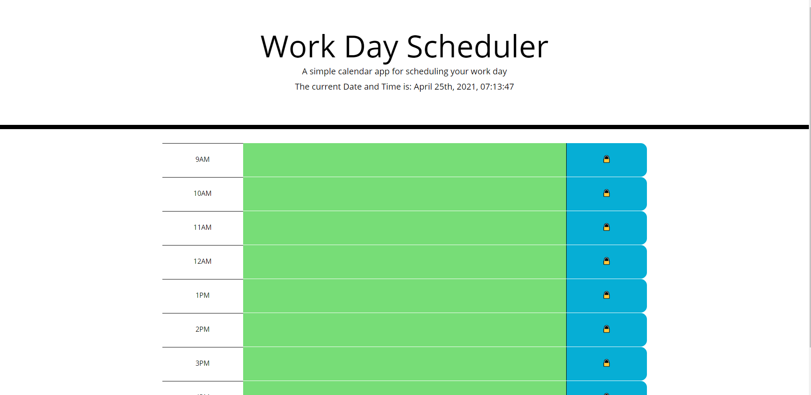

# day-scheaduler

## Description
The day scheaduler is an application that alows the user to write to-do items in slots designated for each hour of the work day. These slots are color coded depending on weather they are in the past present or future. The top of the page also displays the current date and time and is uupdated every second. Once the save button is hit for each entry that entry is stored in local storage and will remain in that timeslot untill it is edited and dsaved again.